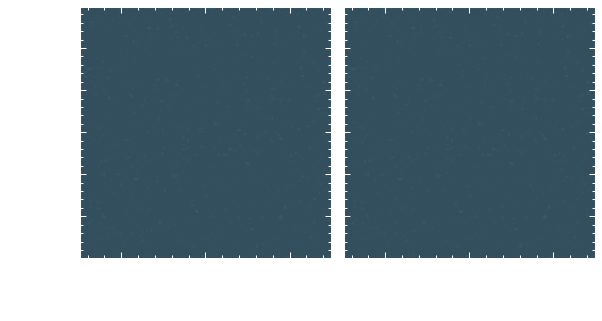

# Federico Serrano
In the south of China you shouldn't flip the fish while eating it. You are meant to eat it from one side because turning the fish over brings misfortune to the fisherperson, as it resembles a flipping boat on the sea. The fish is the boat and the soup is the sea; humans rely on metaphors to understand nature.

<strong style="font-size: 2.5em;"> How do we gain knowledge? </strong>

Using metaphors to describe nature works well in China, but not where I live, for here metaphors are not a source of knowledge anymore. It got me thinking about metaphors and its importance on building knowledge, how, as children, we learn about the world through metaphors. It was after enlightment when knowledge and metaphors detached abruptly to follow separate ways. Before enlightmenet, however, art and science were the same, and the seek of new knowledge was the seek of new metaphors.

Whatever metaphors that you may create or _find_ are not necessarly new knowledge. One can go even further and claim that there aren't new metaphors at all, as [Jorge Luis Borges](https://www.youtube.com/watch?v=o_nsHc4jyGc&t=813s) once said:

 > "The things that are said in literature are always the same. What is important is the way they are said. Looking for metaphors, for example: When I was a young man I was always hunting for new metaphors. Then I found out that really good metaphors are always the same"

He also gave some examples of what _fundamental_ metaphors are: the river is time, sleep is dying, sunset is eld... and also one example of a _bad metaphor_ from [Vicente Huidobro](https://circulodepoesia.com/2018/02/vicente-huidobro-horizon-carre/): the elevator is a thermometer. Believing that good metaphors are always the same, is believing that there aren't new metaphors to look for: that nature is what we know, what we understand. The knowledge system is, therefore, complete.

<strong style="font-size: 5.5em;"> Synthetic knowledge  </strong>

What opposes metaphors are literal statements. [Immanuel Kant](https://en.wikipedia.org/wiki/The_Only_Possible_Argument_in_Support_of_a_Demonstration_of_the_Existence_of_God) identifies two types of statements: analytic and synthetic. Science switched from describing nature through metaphors to describing nature through the latter. We went from "the river is time" to "time is a category of the mind" or "time is a physical parameter".

Synthetic statements are connected and not self-explanatory, they produce a network of concepts and ideas with a higher level of complexity than before. With metaphors one can describe nature but with synthetic statements one can explain the metaphor and its limitations. A new landscape of possibilities opens where language binds everything together, but language is incomplete. Kant described the notion of creating knowledge from synthetic statements as:  

> “But in order to attain this end, one must venture into the bottomless abyss of metaphysics. A dark ocean without shores and without lighthouses, where one must proceed as the seafarer on an uncharted sea, who, as soon as he touches land anywhere, examines and investigates his course, lest unnoticed sea-currents, despite all the caution that the art of navigation may command, have led him astray.”

Here, the system is incomplete and nature remains inscrutable.

<strong style="font-size: 2.5em;"> Analogies instead of metaphors? </strong>

One new way of understanding phenomena is through the process of information. With the advent of computers and clusters we gain the power of understanding nature not by its fundamental mechanism but by its practical consequences. We have computers that are programmable and we used them to integrate (by brute force) data. The result is a map between natural phenomena and effective equations restricted to some regime of validity. We can even go further and define a renormalization-group (RG) flow to know how these maps change over different regimes. The mapping between phenomena and equations is an *analogy*: we understand nature by observables mapped to a model.

This mapping is not unilateral, as we can also map a physical system onto a model. This is the principle of analogical computation.

<!-- 

## Analogies instead of metaphors?

One new way of understanding phenomena is through the process of information. With the advent of computers and clusters we gain the power of understanding nature not by its fundamental mechanism but by its practical consequences. We have computers that are programmable and we used them to integrate (by brute force) data. The result is a map between natural phenomena and effective equations restricted to some regime of validity. We can even go further and define a renormalization-group (RG) flow to know how these maps change over different regimes. The mapping between phenomena and equations is an *analogy*: we understand nature by observables mapped to a model.

This mapping is not unilateral, as we can also map a physical system onto a model. This is the principle of analogical computation.

 -->

<!--

<strong style="font-size: 1.5em;">A time to cast away atoms, and a time to gather atoms together</strong>

### *Thoughts about out-of-equilibrium quantum scattering in Bose-Einstein condensates*

I was in Spokane, Washington when I first heard about the project. [Qingze Guan](https://physics.wsu.edu/people/faculty/qingze-guan/) and [Doerte Blume](https://www.ou.edu/cqrt/people/doerte-blume) invited me to a meeting to discuss some results from an experiment devised by [Peter Engels’ group](https://labs.wsu.edu/engels/). They had been working on a theoretical explanation and were now looking to include me. To be honest, the idea sounded utterly exigent for me, so I wasn't excited.

In the experiment, two Bose-Einstein condensates were made to collide, and the number of atoms scattered out of the condensates was measured. Their attention was on the fact that some of these atoms ended up with negative momentum—something that shouldn't happen classically. The only way to explain it is through [quantum mechanics](https://www.wiley.com/en-us/Quantum+Mechanics%2C+Volume+1%3A+Basic+Concepts%2C+Tools%2C+and+Applications%2C+2nd+Edition-p-9783527822713): two atoms at rest scattered into equal and opposite momenta, $+\hbar \mathbf{k}$ and $-\hbar \mathbf{k}$. It was a subtle effect, but it was visible.

We quickly realized it was far more difficult and involved than expected—the more we worked on it, the more questions emerged. Before long, we started casually referring to it as **The Scattering Project**.

I still don’t have a faithful theoretical description of the experiment—but I can tell what we’ve come to understand so far. The core difficulty lies in the fact that the scattering process sits right at a delicate intersection where two very different types of physics compete.

In the early stages of the collision, the behavior is distinctly quantum: the scattered atoms act like a collective excitation of the condensate, which we can get from the [Bogoliubov theory](https://link.springer.com/article/10.1007/BF02745585). But as time goes on, the scattering becomes increasingly localized and loses coherence, so it cannot be described by elementary excitations anymore.

Capturing this transition accurately is hard. It calls for beyond-mean-field methods, incorporating finite temperature effects, performing stochastic simulations, and even diagonalizing large matrices to resolve the excitation spectrum. What's more, the finite size of the BECs adds spatial inhomogeneity, which we try to account for using different types of [local density approximations](https://www.goodreads.com/book/show/14827621-time-dependent-density-functional-theory).

Moving smoothly between these descriptions—quantum to classical, mean-field to many-body—is precisely what makes the scattering project elusive, and intriguing.

I often talk with Dr. Engels' students about the scattering project—about how they cool down $^{87}\text{Rb}$ atoms to form a condensate, and how they use an optical lattice to split the cloud into two parts with distinct momenta. They then release the system and let it evolve freely; that's when the atoms collide and scatter away. The whole operation takes no more than $18\,\text{ms}$, and they repeat these types of experiments over and over again on a daily basis.

  
  

    <em>
      Image of two Bose-Einstein condensates moving in opposite directions after 18 ms of time of flight. The atoms collide and create a scattering pattern that is not fully described classically. There is a faint presence of atoms that end up on the left side of the brightest cloud (there is no such trace on the right side), indicating quantum depletion during the dynamical process. Image by
      <a href="https://physics.wsu.edu/people/graduate-students/a-mukhopadhyay/">Annesh Mukhopadhyay</a>,
      Colby Schimelfenig, and
      <a href="https://physics.wsu.edu/people/faculty/peter-engels/">Peter Engels</a>.
    </em>
  

The whole activity reminds me of a passage from [Ecclesiastes](https://en.wikipedia.org/wiki/Ecclesiastes):

> A time to cast away stones, and a time to gather stones together;

The original meaning speaks more about the *destruction-construction dichotomy* and less about atoms in quantum condensates. Still, I picture people building a lab, cooling atoms down to near absolute zero, heating them back up, collecting data, permutating this and that parameter, running the experiment again.

I imagine myself programming a computer, forcing it to simulate the system from simple rules —believing, at some level, that those rules are fundamental. In that effort, I feel connected to all those who study Nature, whether with $^{87}\text{Rb}$ atoms or with stones.

While working on this project, there were moments where I felt I was making progress—understanding some underlying physical idea or at least doing things the right way. There were other moments where I felt I was moving backward, weighted down by mistakes too difficult to find, too difficult to correct. I was frustrated.

This project is a tradition: work out difficult problems and find complex solutions that answer nothing. We have been doing the same all over again. Maybe *Ecclesiastes* truly captured the essence of Nature—at least, of human nature. -->

<strong style="font-size: 1.5em;"> What crumbles away cannot be destroyed </strong>

## *I wanted to understand how everything started, I didn't*

Even though I was able to write down my attempt to understand the [theory of inflation](https://inspirehep.net/files/0836d9c7afd62340b94b2233659de60b)

